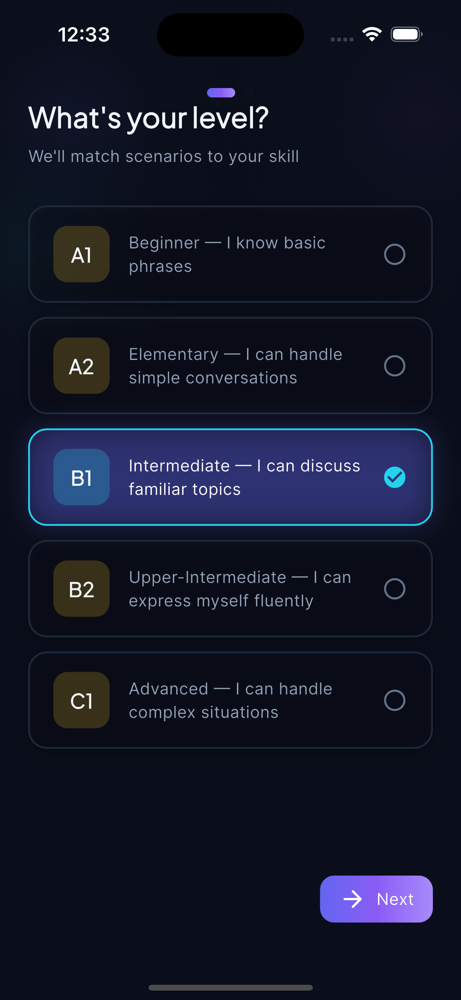
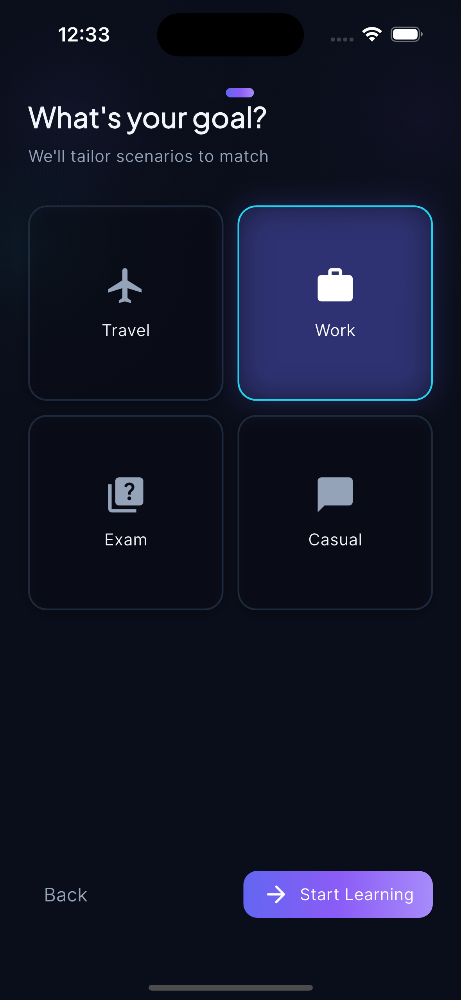
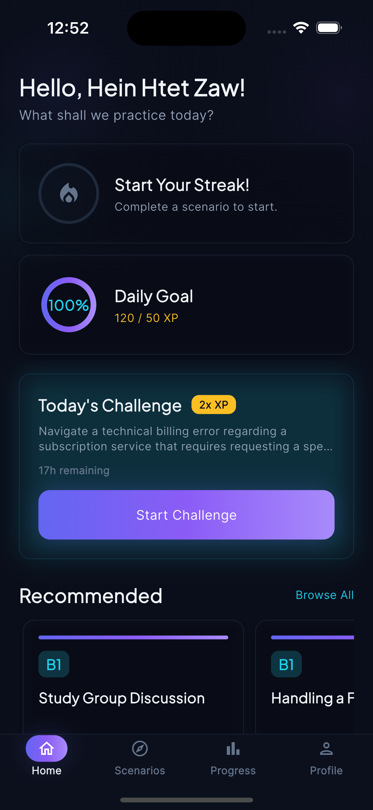
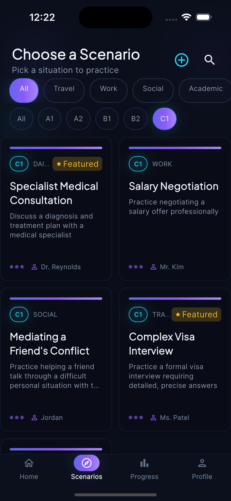
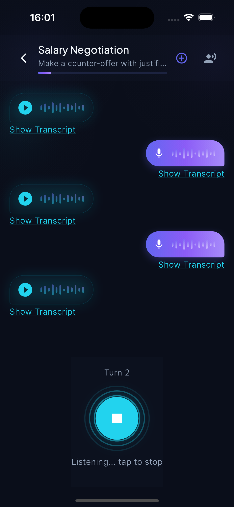
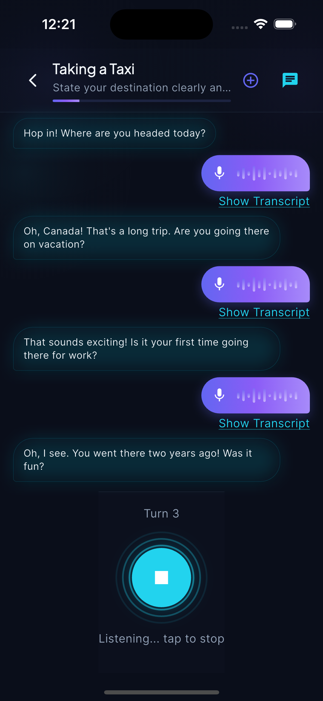
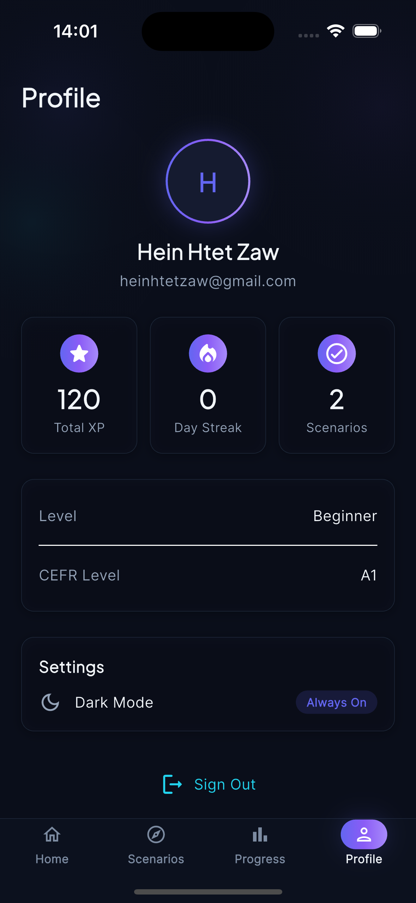
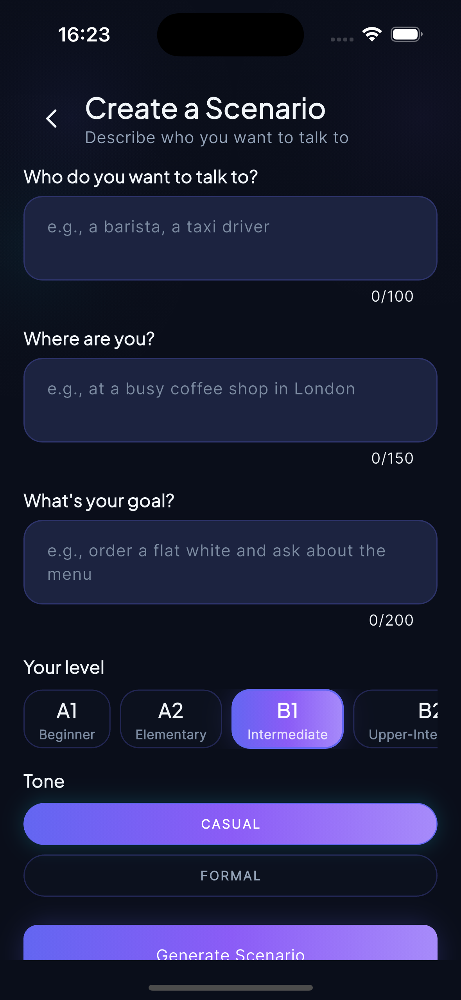

# 🧙 Linguo Wizard

Practice spoken English through simulated real-world dialogues with an AI conversation partner.

[](https://flutter.dev)
[](https://dart.dev)
[](https://firebase.google.com)
[](https://riverpod.dev)
[](LICENSE)

---

## Table of Contents

- [Overview](#overview)
- [Key Features](#key-features)
- [Screenshots](#screenshots)
- [How It Works](#how-it-works)
- [Tech Stack](#tech-stack)
- [Architecture](#architecture)
- [Getting Started](#getting-started)
- [Configuration](#configuration)
- [Testing](#testing)
- [Contributing](#contributing)
- [Security](#security)
- [License](#license)

---

## Overview

Linguo Wizard drops you into realistic real-world conversations from session one — ordering coffee, job interviews, doctor visits, travel situations. An AI conversation partner listens, responds, and adapts to your level. The app tracks your progress with XP and streaks, provides AI-powered grammar feedback, and resurfaces your mistakes through spaced repetition.

**Completely free** — voice input/output uses device-native APIs, and conversations run on the Gemini free tier.

---

## Key Features

| **Voice Conversations** | Speak naturally. The AI listens and responds with voice, like a real conversation partner. |
|---|---|
| **Text-Only Mode** | Toggle off voice for quiet environments or accessibility. AI replies as text bubbles. |
| **Real-World Scenarios** | Curated scenarios: coffee shops, job interviews, doctor visits, travel, networking, and more. |
| **CEFR Level Adaptation** | Filter by level (A1–C1). AI prompts are tuned to your proficiency. |
| **AI Feedback & Scoring** | Post-conversation scores on fluency, grammar, and vocabulary with detailed corrections. |
| **XP & Streaks** | Earn XP per scenario, maintain daily streaks, unlock badges. |
| **Spaced Repetition (SRS)** | Missed phrases resurface in later scenarios so you actually learn from mistakes. |
| **Daily Challenge** | Fresh AI-generated scenario every day with 2× XP bonus. |
| **Profile & Progress** | Dashboard with stats, history, and improvement over time. |
| **Auth Options** | Email, Google, or guest mode — guest progress migrates cleanly on signup. |
| **Rate Limiting** | Server-side daily AI call limits prevent abuse (10 calls/day for guests). |
| **Dark Theme** | Futuristic dark UI with glassmorphism cards, neon glow accents, and mesh gradients. |

---

## Screenshots

### Onboarding Flow

<table>
  <tr>
    <td align="center" width="33%">
      
      <br>
      <sub>Language Selection</sub>
    </td>
    <td align="center" width="33%">
      
      <br>
      <sub>Goal Setting</sub>
    </td>
    <td align="center" width="33%">
      
      <br>
      <sub>CEFR Level Selection</sub>
    </td>
  </tr>
</table>

### Home & Scenario Selection

<table>
  <tr>
    <td align="center" width="50%">
      
      <br>
      <sub>Home Dashboard</sub>
    </td>
    <td align="center" width="50%">
      
      <br>
      <sub>Scenario Selection</sub>
    </td>
  </tr>
</table>

### Conversation Experience

<table>
  <tr>
    <td align="center" width="50%">
      
      <br>
      <sub>Voice Mode Conversation</sub>
    </td>
    <td align="center" width="50%">
      
      <br>
      <sub>Text-Only Mode</sub>
    </td>
  </tr>
</table>

### Profile & Custom Scenarios

<table>
  <tr>
    <td align="center" width="50%">
      
      <br>
      <sub>Profile</sub>
    </td>
    <td align="center" width="50%">
      
      <br>
      <sub>Create Custom Scenario</sub>
    </td>
  </tr>
</table>

---

## How It Works

The core conversation loop runs entirely on-device for voice I/O, with Gemini handling only the AI responses:

```
┌─────────────┐     ┌─────────────┐     ┌─────────────┐
│  Pick a     │────▶│  AI sets    │────▶│  You speak  │
│  scenario   │     │  the scene  │     │  (mic)      │
└─────────────┘     └─────────────┘     └──────┬──────┘
                                               │
                                               ▼
┌─────────────┐     ┌─────────────┐     ┌─────────────┐
│  Evaluation │◀────│  AI responds│◀────│  STT trans- │
│  & scoring  │     │  (Gemini)   │     │  cribes     │
└─────────────┘     └─────────────┘     └─────────────┘
```

1. **Scenario Setup** — Pick a scenario (e.g., "ordering coffee at a London café"). This loads a system prompt describing the AI's persona and the conversation goal.
2. **Conversation** — Speak into the mic. Device-native STT transcribes your audio, the transcript goes to Gemini, and the AI response is spoken back via TTS with the text displayed below the voice bubble.
3. **Text-Only Mode** — Toggle off voice for quiet environments. AI replies as text bubbles.
4. **Turn Limit** — After 20 turns, you're prompted to end the conversation.
5. **Evaluation** — Gemini scores your conversation on fluency, grammar, and vocabulary, with detailed corrections.
6. **Progress** — XP is awarded, streaks update, and missed phrases queue for spaced repetition review.

Guest users get 10 AI calls per day (device-based rate limit). Authenticated users share the same cap, tracked via Firestore.

---

## Tech Stack

| **Layer** | **Technology** |
|---|---|
| Framework | Flutter 3.x, Dart 3.10 |
| State Management | Riverpod 2.x |
| Routing | go_router 17.x |
| Backend | Firebase (Auth + Cloud Firestore) |
| AI Engine | Google Gemini (`gemini-3.1-flash-lite` via `google_generative_ai`) |
| Voice Input | `speech_to_text` (device-native STT) |
| Voice Output | `flutter_tts` (device-native TTS) |
| Auth | `firebase_auth`, `google_sign_in` |
| Local Storage | `shared_preferences`, `path_provider` |
| Device ID | `device_info_plus` (guest rate limiting) |
| Config | `flutter_dotenv` (API keys from `.env`) |
| Animations | `flutter_animate`, `confetti` |
| Typography | `google_fonts` (Plus Jakarta Sans, Inter, JetBrains Mono) |
| Design | Futuristic dark theme — glassmorphism, neon glow, mesh gradients |

---

## Architecture

**Pattern:** MVVM (Model-View-ViewModel) + Feature-first folder structure.

```
lib/
├── core/                        # Shared infrastructure
│   ├── config/                  # App config, Firebase options, CEFR profiles
│   ├── models/                  # Cross-feature data classes (Badge, SrsItem, StreakData)
│   ├── providers/               # Global Riverpod providers (auth, services)
│   ├── services/                # AI, Auth, Firestore, TTS, STT, evaluation, SRS, rate limiting
│   ├── theme/                   # Design tokens (colors, dimensions, gradients, shadows, text styles)
│   └── widgets/                 # Reusable UI components (buttons, cards, chips, nav bar)
│
└── features/                    # Feature modules — each owns its own models/viewmodels/screens/widgets
    ├── auth/                    # Login, signup, forgot password
    ├── conversation/            # Core voice conversation loop (incl. text-only mode)
    ├── feedback/                # Post-conversation scoring & grammar corrections
    ├── home/                    # Dashboard (streak, goals, scenario cards, daily challenge)
    ├── leaderboard/             # Leaderboard screen & viewmodel
    ├── navigation/              # Router config & scaffold with bottom nav
    ├── onboarding/              # First-run setup (language, CEFR level, goals)
    ├── profile/                 # User profile screen
    ├── progress/                # Progress tracking (badges, levels, mistakes)
    ├── scenario_selection/      # Browse & filter scenarios by CEFR level
    ├── splash/                  # App splash/loading screen
    └── srs/                     # Spaced repetition review sessions
```

### Layer Rules

- **Screens** (Views) → Never call services directly. Go through the ViewModel.
- **ViewModels** → Business logic & state machine. Extend `StateNotifier`. Never import widgets.
- **Models** → Plain Dart classes. No framework dependencies.
- **Services** → Stateless wrappers around packages. Injected into ViewModels.

For the full design brief and engineering notes, see [`CLAUDE.md`](CLAUDE.md).

### Firestore Schema

All user data lives under `users/{userId}`, with owner-only access enforced by Security Rules:

```
users/{userId}                        # Profile, streak, XP, display name
├── rateLimits/{date}                 # Daily call counters (10/day cap)
├── conversations/{conversationId}    # Scenario ID, transcript, scores
├── badges/{badgeId}                  # Earned badge metadata
├── srs_items/{itemId}                # Spaced repetition queue (missed phrases)
├── mistakes/{mistakeId}             # Grammar mistake records
└── custom_scenarios/{scenarioId}    # User-created scenarios

scenarios/{scenarioId}                # Public curated catalog
challenges/{date}                     # Daily challenge definitions
```

Security Rules enforce three access patterns:

- **Authenticated users** → read/write only their own `users/{userId}` subcollections
- **Public catalog** → `scenarios/` and `challenges/` are readable by anyone
- **Admin writes** → only users with an `admin` claim can write to public collections

---

## Getting Started

### Prerequisites

- **Flutter SDK** ≥ 3.x (with Dart 3.10+) — [Install Flutter](https://docs.flutter.dev/get-started/install)
- **Firebase CLI** — `npm install -g firebase-tools`
- **FlutterFire CLI** — `dart pub global activate flutterfire_cli`
- A **Firebase project** with Auth and Firestore enabled
- A **Gemini API key** — [Get one free](https://aistudio.google.com/apikey)

### Installation

1. **Clone the repository:**

   ```bash
   git clone https://github.com/heinhtet-zaw12/linguo_wizard.git
   cd linguo_wizard
   ```

2. **Install dependencies:**

   ```bash
   flutter pub get
   ```

3. **Configure environment variables:**

   Create a `.env` file in the project root:

   ```bash
   GEMINI_API_KEY=your_gemini_api_key_here
   ```

   > The `.env` file is gitignored. Never commit API keys.

4. **Generate Firebase config:**

   ```bash
   flutterfire configure
   ```

   This creates `lib/core/config/firebase_options.dart` with your Firebase project configuration.

5. **Run the app:**

   ```bash
   flutter run
   ```

---

## Configuration

| Variable | Description | Where to Set |
|---|---|---|
| `GEMINI_API_KEY` | Google Gemini API key for AI conversations | `.env` file in project root |
| `firebase_options.dart` | Firebase project config (auto-generated) | Generated by `flutterfire configure` |

### Key Constants (`lib/core/config/app_config.dart`)

| Constant | Default | Description |
|---|---|---|
| `geminiModel` | `gemini-3.1-flash-lite` | Gemini model used for conversations |
| `maxConversationTurns` | `20` | Max turns before prompting to end |
| `sttListenTimeout` | `30s` | Max STT listening duration |
| `sttPauseTimeout` | `60s` | Silence timeout before auto-stopping mic |
| `rateLimitEnabled` | `true` | Toggle daily rate limiting (must be `true` in production) |
| `maxDailyCalls` | `10` | Max AI calls/day for guests |
| `xpPerScenario` | `50` | XP earned per completed scenario |

---

## Testing

Tests live in the `test/` directory and cover models and viewmodels:

```bash
flutter test
```

```
test/
├── models/
│   ├── message_test.dart
│   ├── onboarding_data_test.dart
│   └── score_data_test.dart
├── viewmodels/
│   ├── feedback_viewmodel_test.dart
│   ├── onboarding_viewmodel_test.dart
│   └── scenario_selection_test.dart
└── widget_test.dart
```

---

## Contributing

Contributions are welcome! Here's how to get started:

1. **Fork** the repository
2. **Create a branch** — `git checkout -b feature/amazing-feature`
3. **Commit** — `git commit -m 'Add: description of the feature'`
4. **Push** — `git push origin feature/amazing-feature`
5. **Open a Pull Request**

Please ensure:

- Code follows the MVVM architecture rules (see [Architecture](#architecture))
- New features include corresponding tests
- `flutter analyze` passes with no issues
- Commits are descriptive and atomic

---

## Security

This project has undergone a security audit. Key measures:

- **Server-side rate limiting** enforced via Firebase Security Rules (owner-only access to user subcollections)
- **API keys loaded from `.env`** via `flutter_dotenv` — never bundled in compiled app binaries
- **Firestore rules** restrict all user data to authenticated owner-only reads/writes
- **Input sanitization** on user-generated content (display names, chat messages)

For full details on security measures and production deployment requirements, see [`SECURITY.md`](SECURITY.md).

> **Production Note:** For production deployments, proxy Gemini API calls through Firebase Cloud Functions to keep the API key server-side. See `SECURITY.md` for the recommended Cloud Function implementation.

---

## License

This project is licensed under the MIT License — see the [LICENSE](LICENSE) file for details.

---

*Made with ❤️ by [Heinhtet Zaw](https://github.com/heinhtet-zaw12)*
